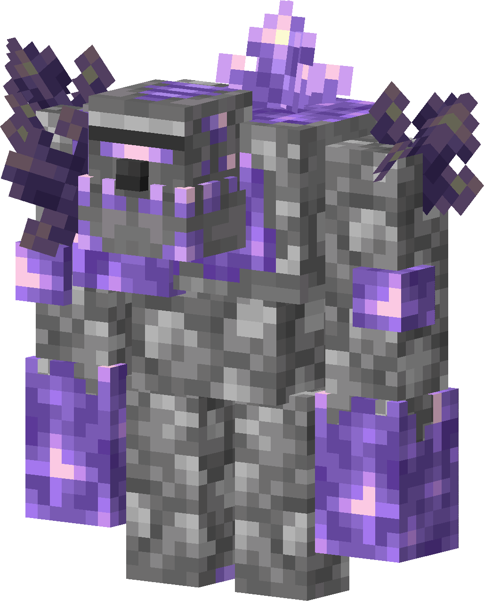

# Amethyst Golem
!!! pied-piper ""
    { align=right width=37% loading=lazy }

    | Amethyst Golem      |                                      |
    | ----------- | ------------------------------------ |
    | ID          | `adventurez:amethyst_golem`          |
    | Health Points | `40` |
    | Attack Strength | `8` |
    | Projectile Strength | `7` |
    | Spawn       | <a href="https://minecraft.fandom.com/wiki/Amethyst_geode" target="_blank">Amethyst Geode</a> |
    | Drops       | 0 - 2 <a href="https://minecraft.fandom.com/wiki/Amethyst_Shard" target="_blank">Amethyst Shard</a>                |
    | Behaivor    | Hostile |

## Story

*The Amethyst Golem don't like the human race since most of the people just have profit in mind.*

*They dig out the amethysts and keep an empty loveless hole behind.*

---

## Behaivor

He is hostile and will attack you from far away or close range.
Also he will try to chase you.

* **Range:** throws amethyst shards at players which deal 7 damage
* **Melee:** swings his arms which deal 8 damage
