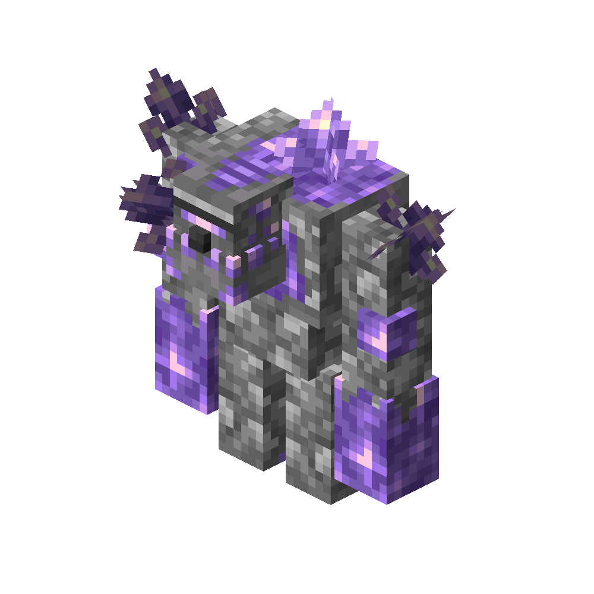

# Amethyst Golem
<div class="combi">
<div class="divthing">
<table class="tablething">
    <tbody>
        <tr>
            <td class="first-column">ID</td>
            <td class="second-column">
            ```
            adventurez:amethyst_golem
            ```
            </td>
        </tr>
        <tr id="linear-top">
            <td class="first-column">Health Points</td>
            <td class="second-column" id="heart-element" heart-count="40"></td>
        </tr>
        <tr id="linear-top">
            <td class="first-column">Armor Points</td>
            <td class="second-column">1</td>
        </tr>
        <tr id="linear-top">
            <td class="first-column">Attack Damage</td>
            <td class="second-column">8</td>
        </tr>
        <tr id="linear-top">
            <td class="first-column">Projectile Damage</td>
            <td class="second-column">7</td>
        </tr>
        <tr id="linear-top">
            <td class="first-column">Spawn</td>
            <td class="second-column"><a href="https://minecraft.fandom.com/wiki/Amethyst_geode" target="_blank">Amethyst Geode</a></td>
        </tr>
        <tr id="linear-top">
            <td class="first-column">Drops</td>
            <td class="second-column">5 XP<br>0 - 2 <a href="https://minecraft.fandom.com/wiki/Amethyst_Shard" target="_blank">Amethyst Shard</a></td>
        </tr>
        <tr id="linear-top">
            <td class="first-column">Behavior</td>
            <td class="second-column">Hostile</td>
        </tr>
    </tbody>
</table>
</div>
<div class="div-img-center">

</div>
</div>

## Story

*The Amethyst Golem don't like the human race since most of the people just have profit in mind.*  
*They dig out the amethysts and keep an empty loveless hole behind.*

---

## Behavior

He is hostile and will attack you from far away or close range.  
Also he will try to chase you.

* **Range:** throws amethyst shards at players which deal 7 damage
* **Melee:** swings his arms which deal 8 damage
