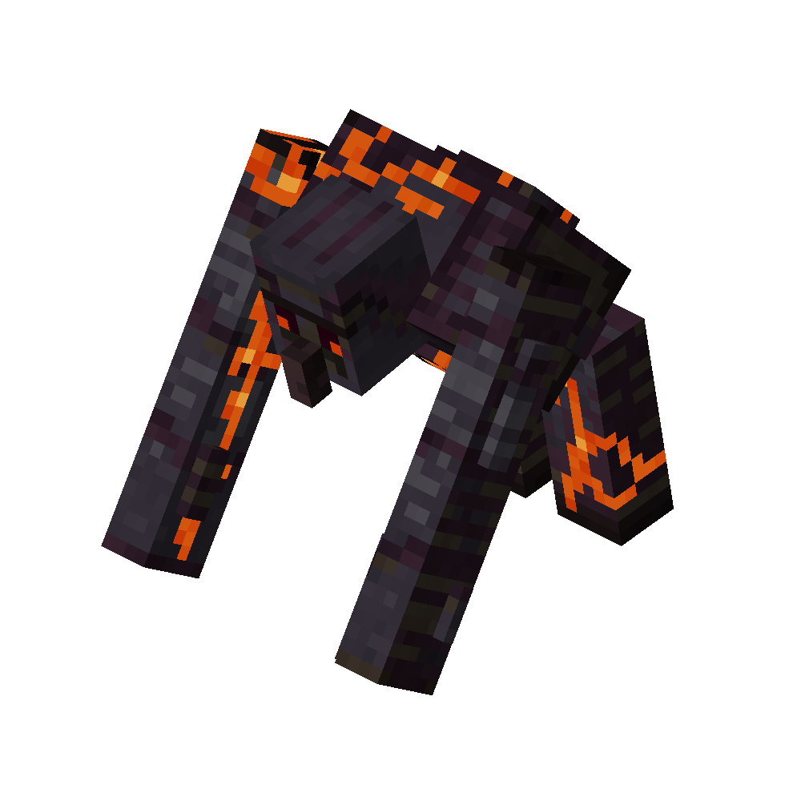

# Blackstone Golem
<div class="combi">
<div class="divthing">
<table class="tablething">
    <tbody>
        <tr>
            <td class="first-column">ID</td>
            <td class="second-column">
            ```
            adventurez:stone_golem
            ```
            </td>
        </tr>
        <tr id="linear-top">
            <td class="first-column">Health Points</td>
            <td class="second-column">600</td>
        </tr>
        <tr id="linear-top">
            <td class="first-column">Attack Strength</td>
            <td class="second-column">14</td>
        </tr>
        <tr id="linear-top">
            <td class="first-column">Thrown Rock</td>
            <td class="second-column">16</td>
        </tr>
        <tr id="linear-top">
            <td class="first-column">Spawn</td>
            <td class="second-column">Can get summoned at the <a href="../../Structures/Golem_Altar/">Golem Altar</a> in <a href="https://minecraft.fandom.com/wiki/The_Nether" target="_blank">the nether</a></td>
        </tr>
        <tr id="linear-top">
            <td class="first-column">Drops</td>
            <td class="second-column">3 - 7 <a href="https://minecraft.fandom.com/wiki/Blackstone" target="_blank">Blackstone</a><br>0 - 2 <a href="https://minecraft.fandom.com/wiki/Ancient_Debris" target="_blank">Ancient Debris</a><br>0 - 2 <a href="https://minecraft.fandom.com/wiki/Netherite_Scrap" target="_blank">Netherite Scrap</a><br>0 - 1 <a href="../../Items/Gilded_Netherite_Fragment/">Gilded Netherite Fragment</a><br>0 - 1 <a href="../../Items/Stone_Golem_Heart/">Stone Golem Heart</a></td>
        </tr>
        <tr id="linear-top">
            <td class="first-column">Type</td>
            <td class="second-column">Boss</td>
        </tr>
        <tr id="linear-top">
            <td class="first-column">Behavior</td>
            <td class="second-column">Hostile</td>
        </tr>
    </tbody>
</table>
</div>
<div class="div-img-center">

</div>
</div>

## Story

*The Blackstone Golem is the most deadliest creature in the world of Minecraft.*  
*Summoned at the Golem Altar, it will destroy the world until it killed all players.*

## Behavior

The Blackstone Golem will start to get flooded with lava when summoned and shouts loud when it awakens.  
The boss will try to chase and hit the player with it's arms while also breaking blocks which are inbetween.

* **Melee:** swings arms which deal 14 damage
* **Mid-Range:** throws rocks at the player which deal 16 damage and give side effects like hunger, slowness and blindness
* **Special:** activates rage mode when lass than half hp

## Drops
| Drop | Use |
| --- | --- |
| 0 - 1 Gilded Netherite Fragment | :material-menu-up-outline: Upgrade to gilded netherite armor / weapons / tools |
| 0 - 1 Stone Golem Heart | :material-file-replace-outline: Ingredient for golem arm |
|  | :material-menu-up-outline: Upgrade the iron golem |
|  | :material-heart-cog-outline: Replace your own heart to get the blackstoned effect |