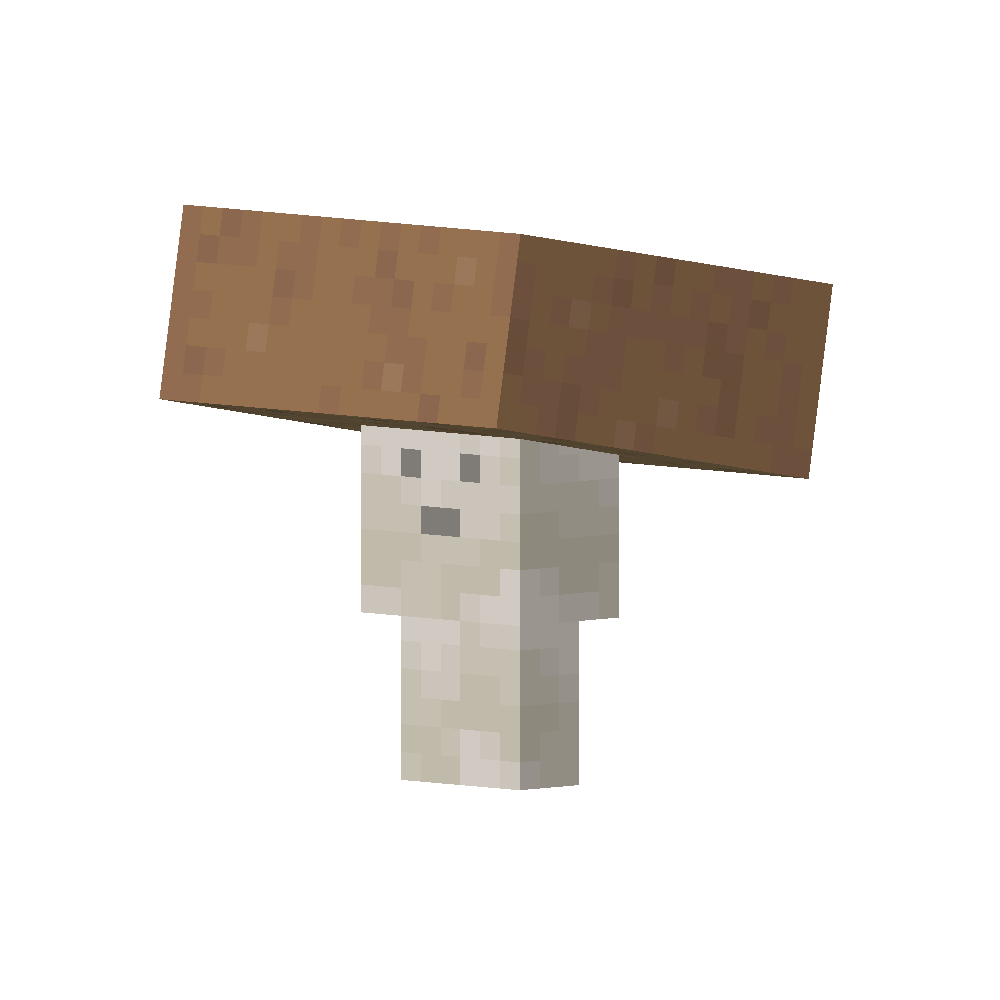

# Brown Fungus
!!! pied-piper ""
    { align=right width=37% loading=lazy }

    | Brown Fungus |  |
    | ----------- | ------------------------------------ |
    | ID          | `adventurez:brown_fungus`          |
    | Health Points | `10` |
    | Attack Strength | `1` |
    | Spawn       | <a href="https://minecraft.fandom.com/wiki/Mushroom_Fields" target="_blank">Mushroom Fields</a> |
    | Drops       | 0 - 1 <a href="https://minecraft.fandom.com/wiki/Mushroom" target="_blank">Brown Mushroom</a> |
    | Behaivor    | Neutral |

## Story

*The Brown Fungus is a peaceful creature which has a very cute voice.*

---

## Behaivor

He is a neutral creature and only attacks the player when attacked by a player.

If he's angry he will call other nearby fungus to attack the threat by chasing it.

* **Melee:** spores the threat which deals 1 damage