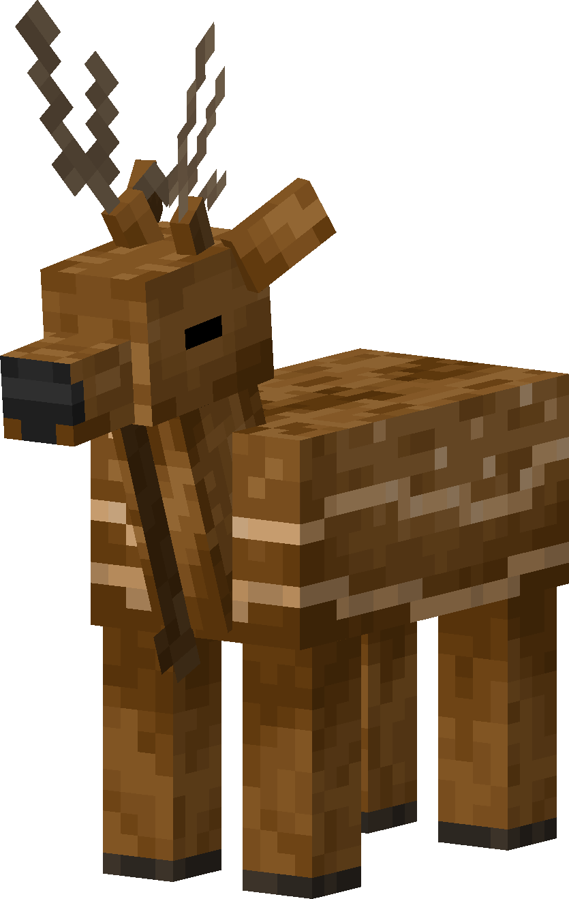

# Deer
<div class="combi" markdown>
<div class="divthing">
<table class="tablething">
    <tbody>
        <tr>
            <td class="first-column">ID</td>
            <td class="second-column">
            ```
            adventurez:deer
            ```
            </td>
        </tr>
        <tr id="linear-top">
            <td class="first-column">Health Points</td>
            <td class="second-column">10</td>
        </tr>
        <tr id="linear-top">
            <td class="first-column">Usable Items</td>
            <td class="second-column"><a href="https://minecraft.fandom.com/wiki/Grass" target="_blank">Grass</a><br><a href="https://minecraft.fandom.com/wiki/Lead" target="_blank">Lead</a></td>
        </tr>
        <tr id="linear-top">
            <td class="first-column">Spawn</td>
            <td class="second-column">Same biomes as <a href="https://minecraft.fandom.com/wiki/Cow#Spawning" target="_blank">cow</a> and on <a href="https://minecraft.fandom.com/wiki/Grass_Block" target="_blank">grass blocks</a></td>
        </tr>
        <tr id="linear-top">
            <td class="first-column">Drops</td>
            <td class="second-column">0 - 2 <a href="https://minecraft.fandom.com/wiki/Leather" target="_blank">Leather</a><br>1 - 3 <a href="../../Items/Raw_Venison/">Raw Venison</a></td>
        </tr>
        <tr id="linear-top">
            <td class="first-column">Behavior</td>
            <td class="second-column">Passive</td>
        </tr>
    </tbody>
</table>
</div>
<div>

</div>
</div>

## Behavior

Deers are peaceful creatures shy but also careful.  
They will run away from players if they come too close.

## Drops
| Drop | Use |
| --- | --- |
| 0 - 2 <a href="https://minecraft.fandom.com/wiki/Leather" target="_blank">Leather</a> |  |
| 1 - 3 <a href="../../Items/Raw_Venison/">Raw Venison</a> | :material-chef-hat: Can be cooked into <a href="../../Items/Cooked_Venison/">cooked venison</a> |