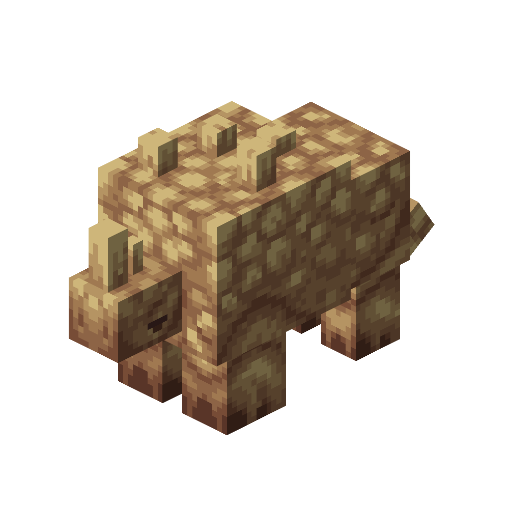

# Desert Rhino
<div class="combi">
<div class="divthing">
<table class="tablething">
    <tbody>
        <tr>
            <td class="first-column">ID</td>
            <td class="second-column">
            ```
            adventurez:desert_rhino
            ```
            </td>
        </tr>
        <tr id="linear-top">
            <td class="first-column">Health Points</td>
            <td class="second-column">60</td>
        </tr>
        <tr id="linear-top">
            <td class="first-column">Attack Strength</td>
            <td class="second-column">9</td>
        </tr>
        <tr id="linear-top">
            <td class="first-column">Spawn</td>
            <td class="second-column"><a href="https://minecraft.fandom.com/wiki/Desert" target="_blank">Desert</a> and next to <a href="../../Structures/Desert_Well/">desert wells</a></td>
        </tr>
        <tr id="linear-top">
            <td class="first-column">Drops</td>
            <td class="second-column">0 - 2 <a href="../../Items/Rhino_Leather/">Rhino Leather</a><br>1 - 2 <a href="../../Items/Rhino_Meat/">Rhino Meat</a></td>
        </tr>
        <tr id="linear-top">
            <td class="first-column">Behavior</td>
            <td class="second-column">Hostile</td>
        </tr>
    </tbody>
</table>
</div>
<div class="div-img-center">

</div>
</div>

## Story

*Desert Rhinos are endangered creatures and will try everything to protect themselves.*

---

## Behavior

The Desert Rhino will charge at the player with a sprint and tries to knock him back with his horn.  
He will then chase the player and will wait for another sprint attack.

* **Sprint-Melee:** sprints with his horn which deals 9 damage & knockback on impact

## Drops
| Drop | Use |
| --- | --- |
| 0 - 2 <a href="../../Items/Rhino_Leather/">Rhino Leather</a> | :material-label-outline: `c:leather` |
| 1 - 2 <a href="../../Items/Rhino_Meat/">Rhino Meat</a> | :material-chef-hat: Can be cooked into <a href="../../Items/Cooked_Rhino_Meat/">cooked rhino meat</a> |