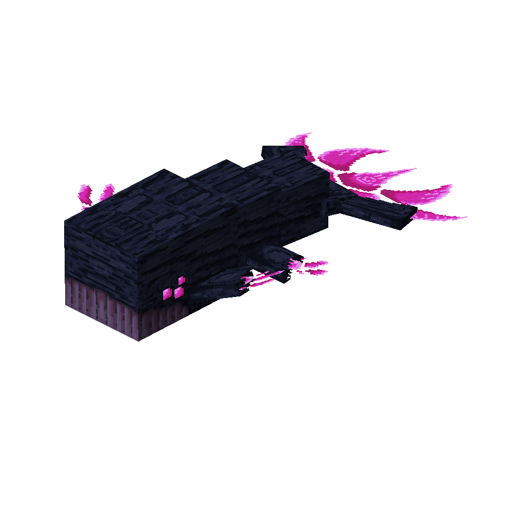

# Ender Whale
<div class="combi" markdown>
<div class="divthing">
<table class="tablething">
    <tbody>
        <tr>
            <td class="first-column">ID</td>
            <td class="second-column">
            ```
            adventurez:ender_whale
            ```
            </td>
        </tr>
        <tr id="linear-top">
            <td class="first-column">Health Points</td>
            <td class="second-column">60</td>
        </tr>
        <tr id="linear-top">
            <td class="first-column">Usable Items</td>
            <td class="second-column"><a href="../../Items/Chorus_Fruit_on_a_Stick/">Chorus fruit on a stick</a><br><a href="../../Items/Ender_Flute/">Ender flute</a></td>
        </tr>
        <tr id="linear-top">
            <td class="first-column">Spawn</td>
            <td class="second-column">In mid air in <a href="https://minecraft.fandom.com/wiki/The_End" target="_blank">the end</a> dimension</td>
        </tr>
        <tr id="linear-top">
            <td class="first-column">Drops</td>
            <td class="second-column">0 - 2 <a href="../../Items/Ender_Whale_Skin/">Ender Whale Skin</a><br>1 - 3 <a href="../../Items/Ender_Whale_Meat/">Ender Whale Meat</a></td>
        </tr>
        <tr id="linear-top">
            <td class="first-column">Behavior</td>
            <td class="second-column">Passive</td>
        </tr>
    </tbody>
</table>
</div>
<div>

</div>
</div>

## Story

*The Ender Whale is a very calm creature, floats around in the endless void and has a deep voice.*

---

## Rideable
He can carry up to 2 players on his back.

* Steerable with a <a href="../../Items/Chorus_Fruit_on_a_Stick/">chorus fruit on a stick</a>
* Called to a player if he's nearby with an <a href="../../Items/Ender_Flute/">ender flute</a>

## Drops
| Drop | Use |
| --- | --- |
| 0 - 2 <a href="../../Items/Ender_Whale_Skin/">Ender Whale Skin</a> | :material-label-outline: `c:leather` |
| 1 - 3 <a href="../../Items/Ender_Whale_Meat/">Ender Whale Meat</a> | :material-chef-hat: Can be cooked into <a href="../../Items/Cooked_Ender_Whale_Meat/">cooked ender whale meat</a> :material-arrow-right: will grant <a href="https://minecraft.fandom.com/wiki/Levitation" target="_blank">levitation</a> for 30s |
