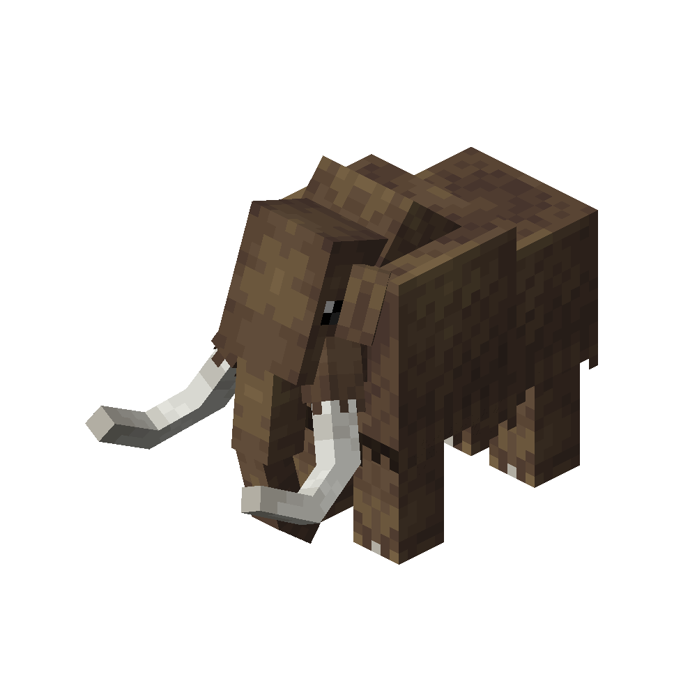

# Mammoth
<div class="combi">
<div class="divthing">
<table class="tablething">
    <tbody>
        <tr>
            <td class="first-column">ID</td>
            <td class="second-column">
            ```
            adventurez:mammoth
            ```
            </td>
        </tr>
        <tr id="linear-top">
            <td class="first-column">Health Points</td>
            <td class="second-column">40</td>
        </tr>
        <tr id="linear-top">
            <td class="first-column">Attack Strength</td>
            <td class="second-column">7</td>
        </tr>
        <tr id="linear-top">
            <td class="first-column">Spawn</td>
            <td class="second-column">In cold biomes like <a href="https://minecraft-biomes.fandom.com/wiki/Ice_Plains" target="_blank">ice plains</a> or <a href="https://minecraft.fandom.com/de/wiki/Taiga" target="_blank">taiga</a></td>
        </tr>
        <tr id="linear-top">
            <td class="first-column">Drops</td>
            <td class="second-column">0 - 2 <a href="../../Items/Mammoth_Fur/">Mammoth Fur</a><br>1 - 3 <a href="../../Items/Mammoth_Meat/">Mammoth Meat</a><br>0 - 1 <a href="../../Items/Mammoth_Tusk/">Mammoth Tusk</a></td>
        </tr>
        <tr id="linear-top">
            <td class="first-column">Behavior</td>
            <td class="second-column">Neutral</td>
        </tr>
    </tbody>
</table>
</div>
<div class="div-img-center">

</div>
</div>

## Story

*The mammoth, despite being an extinct animal, continues to exist within the world of Minecraft. Adorned with thick fur, it possesses remarkable resistance to extremely cold temperatures.*

## Behavior

The mammoth is a neutral creature and will not initiate an attack unless provoked.

* **Melee:** It chases the player and delivers damaging blows using its tusks, dealing 7 points of damage.

## Drops
| Drop | Use |
| --- | --- |
| 0 - 2 <a href="../../Items/Mammoth_Fur/">Mammoth Fur</a> | :material-label-outline: `c:leather` |
| 1 - 3 <a href="../../Items/Mammoth_Meat/">Mammoth Meat</a> | :material-chef-hat: Can be cooked into <a href="../../Items/Cooked_Mammoth_Meat/">cooked mammoth meat</a> |
| 0 - 1 <a href="../../Items/Mammoth_Tusk/">Mammoth Tusk</a> | :material-file-replace-outline: Ingredient for <a href="../../Items/Ivory_Arrow/">ivory arrows</a> |