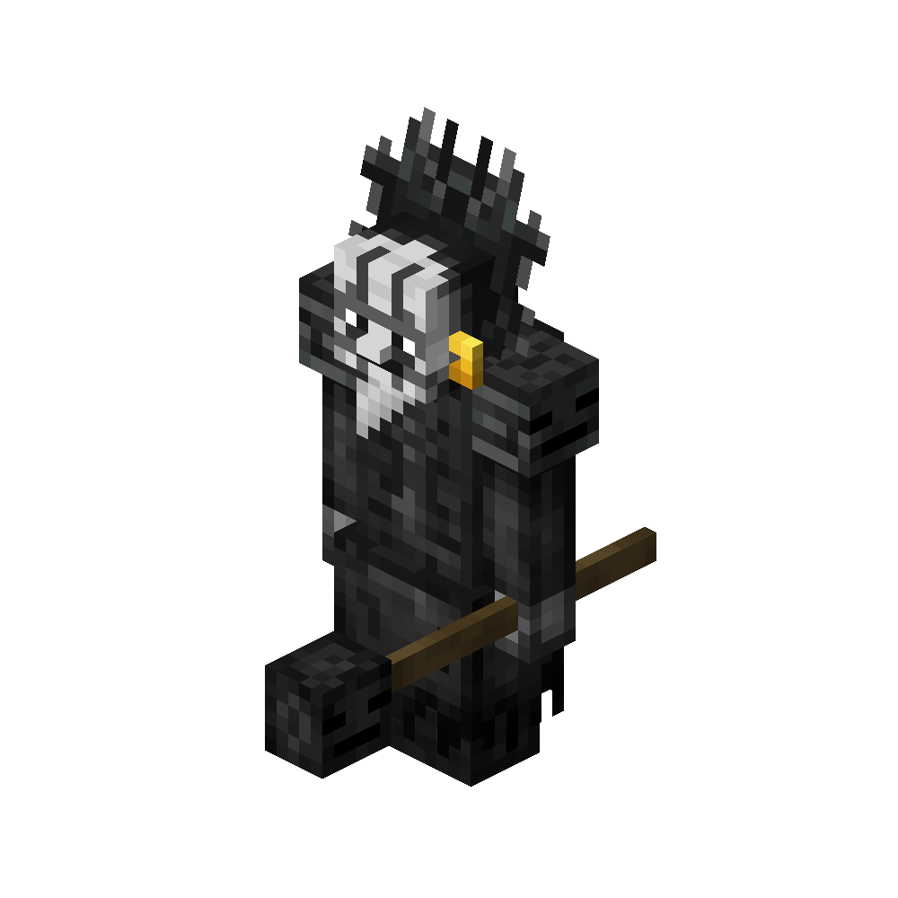

# Necromancer
<div class="combi">
<div class="divthing">
<table class="tablething">
    <tbody>
        <tr>
            <td class="first-column">ID</td>
            <td class="second-column">
            ```
            adventurez:necromancer
            ```
            </td>
        </tr>
        <tr id="linear-top">
            <td class="first-column">Health Points</td>
            <td class="second-column">45</td>
        </tr>
        <tr id="linear-top">
            <td class="first-column">Attack Strength</td>
            <td class="second-column">5</td>
        </tr>
        <tr id="linear-top">
            <td class="first-column">Summons</td>
            <td class="second-column"><a href="../Wither_Puppet/">Wither Puppets</a></td>
        </tr>
        <tr id="linear-top">
            <td class="first-column">Spawn</td>
            <td class="second-column">In <a href="https://minecraft.fandom.com/wiki/Nether_Fortress" target="_blank">nether fortresses</a></td>
        </tr>
        <tr id="linear-top">
            <td class="first-column">Drops</td>
            <td class="second-column">1 - 3 <a href="https://minecraft.fandom.com/wiki/Gold_Nugget" target="_blank">Gold Nugget</a><br>0 - 1 <a href="https://minecraft.fandom.com/wiki/Enchanted_Book" target="_blank">Enchanted Book Lvl 30</a></td>
        </tr>
        <tr id="linear-top">
            <td class="first-column">Behavior</td>
            <td class="second-column">Hostile</td>
        </tr>
    </tbody>
</table>
</div>
<div class="div-img-center">

</div>
</div>

## Story

*The dark Necromancer made nether fortresses to his home.*  
*He learned how to use dark magic and will summon <a href="../Wither_Puppet/">Wither Puppets</a> to protect himself from enemies.*

## Behavior

He is hostile and will summon Wither Puppets to help him against his threat.  
Usually he will run away.

* **Melee:** hits the player with his staff which deals 5 damage
* **Summon:** he summons <a href="../Wither_Puppet/">wither puppets</a> which chase the player & share the wither effect
* **Special:** magically summons a hidden effect onto the player