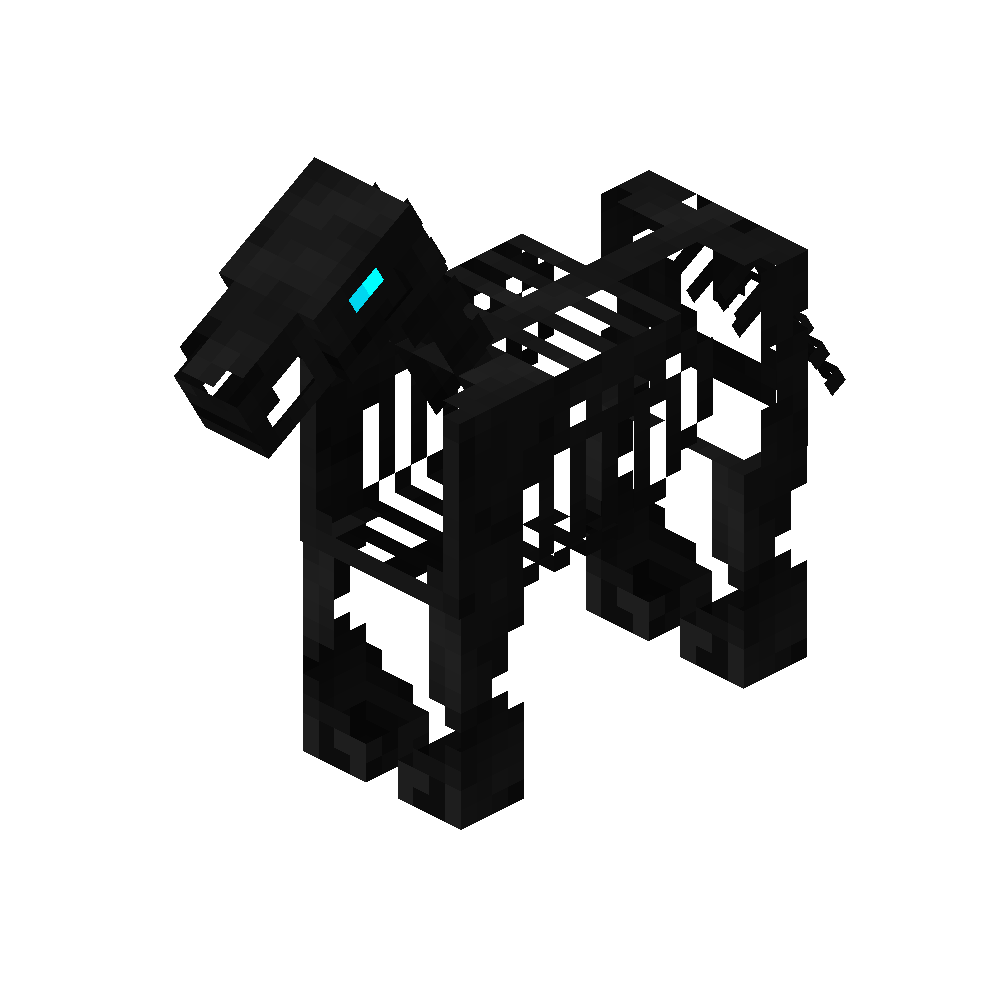

# Nightmare
<div class="combi">
<div class="divthing">
<table class="tablething">
    <tbody>
        <tr>
            <td class="first-column">ID</td>
            <td class="second-column">
            ```
            adventurez:nightmare
            ```
            </td>
        </tr>
        <tr id="linear-top">
            <td class="first-column">Health Points</td>
            <td class="second-column">40</td>
        </tr>
        <tr id="linear-top">
            <td class="first-column">Usable Items</td>
            <td class="second-column">Same as <a href="https://minecraft.fandom.com/wiki/Horse" target="_blank">horse</a></td>
        </tr>
        <tr id="linear-top">
            <td class="first-column">Spawn</td>
            <td class="second-column">In <a href="https://minecraft.fandom.com/wiki/Soul_Sand_Valley" target="_blank">soul sand valley</a> together with the <a href="../Soul_Reaper/">soul reaper</a></td>
        </tr>
        <tr id="linear-top">
            <td class="first-column">Drops</td>
            <td class="second-column">-</td>
        </tr>
        <tr id="linear-top">
            <td class="first-column">Behavior</td>
            <td class="second-column">Passive</td>
        </tr>
    </tbody>
</table>
</div>
<div class="div-img-center">

</div>
</div>

## Story

*The Nightmare is an eerie horse with a tormented and restless spirit. It serves as a mount for the enigmatic <a href="../Soul_Reaper/">Soul Reaper</a>, a figure of dark allure. This gentelman can get tamed like <a href="https://minecraft.fandom.com/wiki/Horse" target="_blank">horses</a>.*

## Rideable

Nightmares can be ridden like regular <a href="https://minecraft.fandom.com/wiki/Horse" target="_blank">horses</a>.

* They are faster when on <a href="https://minecraft.fandom.com/wiki/Soul_Sand" target="_blank">soul sand</a>.
* <a href="https://minecraft.fandom.com/wiki/Water" target="_blank">Water</a> is harmful to Nightmares.