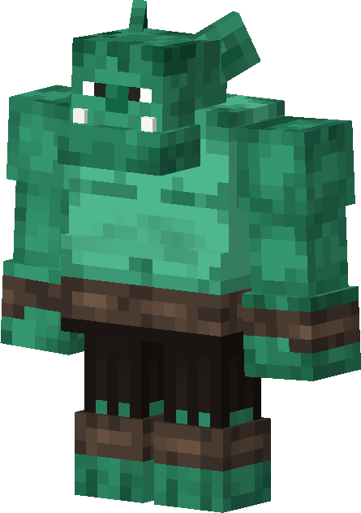

# Orc
<div class="combi">
<div class="divthing">
<table class="tablething">
    <tbody>
        <tr>
            <td class="first-column">ID</td>
            <td class="second-column">
            ```
            adventurez:orc
            ```
            </td>
        </tr>
        <tr id="linear-top">
            <td class="first-column">Sizes</td>
            <td class="second-column">Small / Medium / Large</td>
        </tr>
        <tr id="linear-top">
            <td class="first-column">Health Points</td>
            <td class="second-column">16 / 38 / 54</td>
        </tr>
        <tr id="linear-top">
            <td class="first-column">Attack Strength</td>
            <td class="second-column">3 / 5 / 7</td>
        </tr>
        <tr id="linear-top">
            <td class="first-column">Spawn</td>
            <td class="second-column">In <a href="https://minecraft.fandom.com/wiki/Plains" target="_blank">plains</a> biomes</td>
        </tr>
        <tr id="linear-top">
            <td class="first-column">Drops</td>
            <td class="second-column">0 - 2 <a href="../../Items/Orc_Skin/">Orc Skin</a><br>0 - 1 <a href="https://minecraft.fandom.com/wiki/Emerald" target="_blank">Emerald</a><br>0 - 1 <a href="https://minecraft.fandom.com/wiki/Lead" target="_blank">Lead</a><br>0 - 1 <a href="https://minecraft.fandom.com/wiki/Name_Tag" target="_blank">Name Tag</a><br>0 - 1 <a href="https://minecraft.fandom.com/wiki/Saddle" target="_blank">Saddle</a></td>
        </tr>
        <tr id="linear-top">
            <td class="first-column">Behavior</td>
            <td class="second-column">Hostile</td>
        </tr>
    </tbody>
</table>
</div>
<div class="div-img-center">

</div>
</div>

## Story

*The Orc is an avoided creature, quite angry all the thime and loves shiny items.*  
*They appear in small, medium and large sizes.*

## Behavior

Orcs tipically wander around in small groups, lead by a big orc.  
They hunt <a href="https://minecraft.fandom.com/wiki/Villager" target="_blank">villagers</a> but also try to kill players for their goods.

=== "Small Orc"
    * **Melee:** punches the threat which deals 3 damage
    * **Special:** steals a <a href="https://minecraft.fandom.com/wiki/Tool" target="_blank">tool item</a> from the player
=== "Medium Orc"
    * **Melee:** punches the threat which deals 5 damage
=== "Large Orc"
    * **Melee:** punches the threat which deals 7 damage