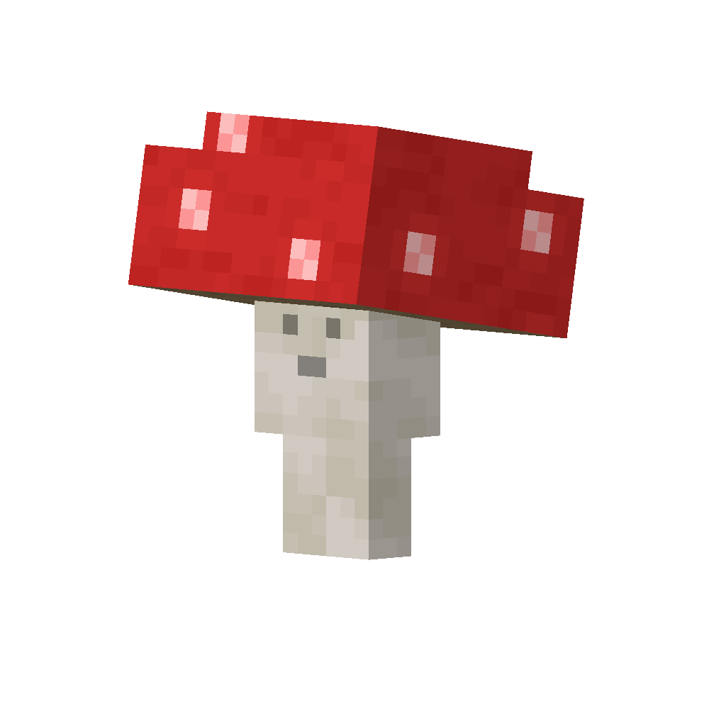

# Red Fungus
<div class="combi">
<div class="divthing">
<table class="tablething">
    <tbody>
        <tr>
            <td class="first-column">ID</td>
            <td class="second-column">
            ```
            adventurez:red_fungus
            ```
            </td>
        </tr>
        <tr id="linear-top">
            <td class="first-column">Health Points</td>
            <td class="second-column">10</td>
        </tr>
        <tr id="linear-top">
            <td class="first-column">Attack Strength</td>
            <td class="second-column">1</td>
        </tr>
        <tr id="linear-top">
            <td class="first-column">Spawn</td>
            <td class="second-column"><a href="https://minecraft.fandom.com/wiki/Mushroom_Fields" target="_blank">Mushroom Fields</a></td>
        </tr>
        <tr id="linear-top">
            <td class="first-column">Drops</td>
            <td class="second-column">0 - 1 <a href="https://minecraft.fandom.com/wiki/Mushroom" target="_blank">Red Mushroom</a></td>
        </tr>
        <tr id="linear-top">
            <td class="first-column">Behavior</td>
            <td class="second-column">Neutral</td>
        </tr>
    </tbody>
</table>
</div>
<div class="div-img-center">

</div>
</div>

## Story

*The Red Fungus is a peaceful creature which has a very cute voice.*  
*The <a href="../Brown_Fungus/">Brown Fungus</a> are their siblings.*

---

## Behavior

This fungus is a neutral creature and only attacks the threat when provoked.  
If angry they will call other nearby fungus to attack the threat by chasing it.

* **Melee:** spores the threat which deals 1 damage