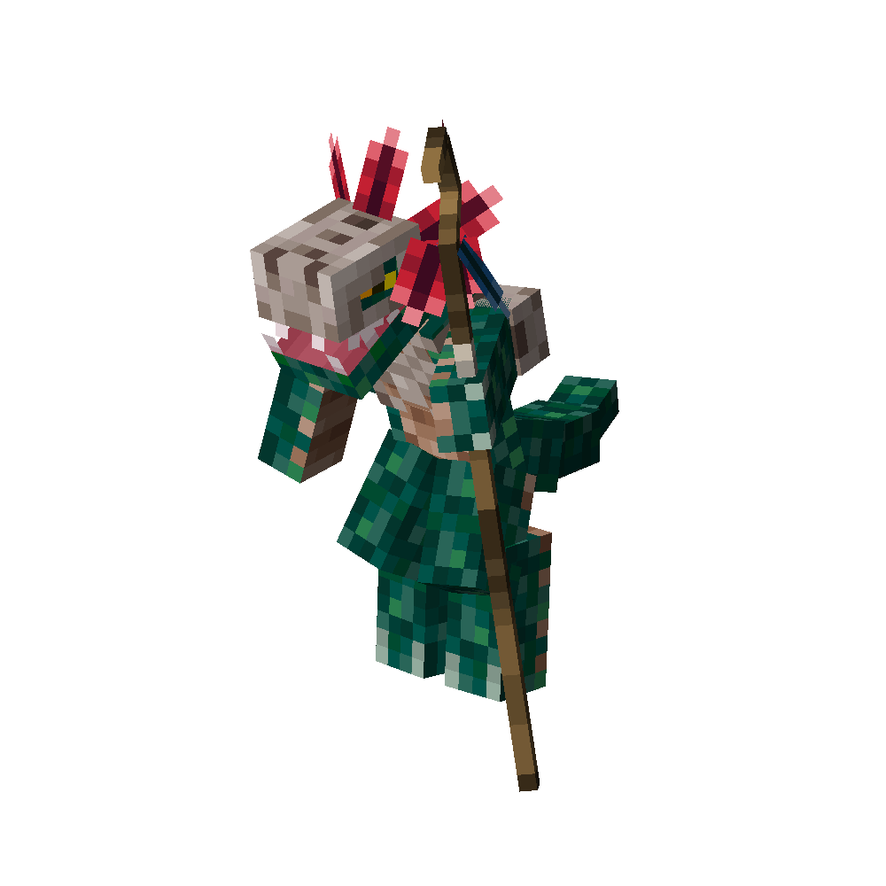

# Shaman
<div class="combi">
<div class="divthing">
<table class="tablething">
    <tbody>
        <tr>
            <td class="first-column">ID</td>
            <td class="second-column">
            ```
            adventurez:shaman
            ```
            </td>
        </tr>
        <tr id="linear-top">
            <td class="first-column">Health Points</td>
            <td class="second-column">40</td>
        </tr>
        <tr id="linear-top">
            <td class="first-column">Attack Strength</td>
            <td class="second-column">6</td>
        </tr>
        <tr id="linear-top">
            <td class="first-column">Spawn</td>
            <td class="second-column">In <a href="https://minecraft.fandom.com/wiki/Swamp" target="_blank">swamp</a> biomes</td>
        </tr>
        <tr id="linear-top">
            <td class="first-column">Drops</td>
            <td class="second-column">0 - 1 <a href="https://minecraft.fandom.com/wiki/Slimeball" target="_blank">Slimeball</a><br>0 - 1 <a href="https://minecraft.fandom.com/wiki/Feather" target="_blank">Feather</a><br>0 - 1 <a href="https://minecraft.fandom.com/wiki/Fermented_Spider_Eye" target="_blank">Fermented Spider Eye</a><br>0 - 1 <a href="https://minecraft.fandom.com/wiki/Mushroom" target="_blank">Brown Mushroom</a><br>0 - 1 <a href="https://minecraft.fandom.com/wiki/Mushroom" target="_blank">Red Mushroom</a><br>0 - 1 <a href="https://minecraft.fandom.com/wiki/Scute" target="_blank">Scute</a></td>
        </tr>
        <tr id="linear-top">
            <td class="first-column">Behavior</td>
            <td class="second-column">Hostile</td>
        </tr>
    </tbody>
</table>
</div>
<div class="div-img-center">

</div>
</div>

## Story

*The Shaman is a formidable swamp lizard skilled in dark magic and witchcraft. Their head is protected by a skull, and their staff grants them mystic powers.*

## Behavior

* **Melee:** The Shaman strikes with their staff, dealing 6 damage to opponents.
* **Range:** Occasionally, when attacked from a distance, the Shaman unleashes powerful thunderbolts as a countermeasure.
* **Summons:** The Shaman has the ability to summon other hostile creatures from the swamp to defend their territory. These summoned creatures act as protectors, aiding the Shaman in warding off intruders and maintaining the sanctity of the swamp.
    * <a href="https://minecraft.fandom.com/wiki/Zombie" target="_blank">Zombie</a>
    * <a href="https://minecraft.fandom.com/wiki/Skeleton" target="_blank">Skeleton</a>
    * <a href="https://minecraft.fandom.com/wiki/Spider" target="_blank">Spider</a>
    * <a href="https://minecraft.fandom.com/wiki/Cave_Spider" target="_blank">cave Spider</a>
* **Special:** The Shaman can cast <a href="https://minecraft.fandom.com/wiki/Weakness" target="_blank">weakness</a> spells and inflict <a href="https://minecraft.fandom.com/wiki/Poison" target="_blank">poision</a> on the player.