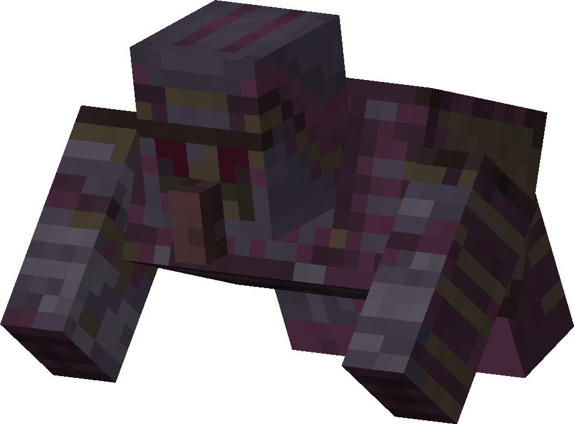

# Small Blackstone Golem
<div class="combi">
<div class="divthing">
<table class="tablething">
    <tbody>
        <tr>
            <td class="first-column">ID</td>
            <td class="second-column">
            ```
            adventurez:small_stone_golem
            ```
            </td>
        </tr>
        <tr id="linear-top">
            <td class="first-column">Health Points</td>
            <td class="second-column">50</td>
        </tr>
        <tr id="linear-top">
            <td class="first-column">Attack Strength</td>
            <td class="second-column">6</td>
        </tr>
        <tr id="linear-top">
            <td class="first-column">Spawn</td>
            <td class="second-column">In <a href="https://minecraft.fandom.com/wiki/Basalt_Deltas" target="_blank">basalt</a> biomes and the <a href="../../Entities/Blackstone_Golem/">Blackstone Golem </a> breaks into them</td>
        </tr>
        <tr id="linear-top">
            <td class="first-column">Drops</td>
               <td class="second-column">0 - 1 <a href="https://minecraft.fandom.com/wiki/Ancient_Debris" target="_blank">Ancient Debris</a><br>0 - 1 <a href="https://minecraft.fandom.com/wiki/Netherite_Scrap" target="_blank">Netherite Scrap</a><br>2 - 3 <a href="https://minecraft.fandom.com/wiki/Blackstone" target="_blank">Blackstone</a></td>
        </tr>
        <tr id="linear-top">
            <td class="first-column">Behavior</td>
            <td class="second-column">Hostile</td>
        </tr>
    </tbody>
</table>
</div>
<div class="div-img-center">

</div>
</div>

## Story

*Enveloped in a faint glow, reminiscent of the molten lava that flowed beneath the Basalt biome, the Small Blackstone Golems set out on their eternal watch. They roamed the land, ever vigilant, unleashing resolute roars that echoed through the canyons, a testament to their unwavering dedication to protect the sacred realm they called home.*

## Behavior

The Small Blackstone Golem is a miniature version derived from the formidable Blackstone Golem. When the Blackstone Golem meets its demise, it gives rise to two Small Blackstone Golems. These diminutive constructs are also known to spawn naturally in the Basalt biome.

* **Melee:** The Small Blackstone Golem attacks by swinging its powerful arms, dealing 6 damage to its opponents.