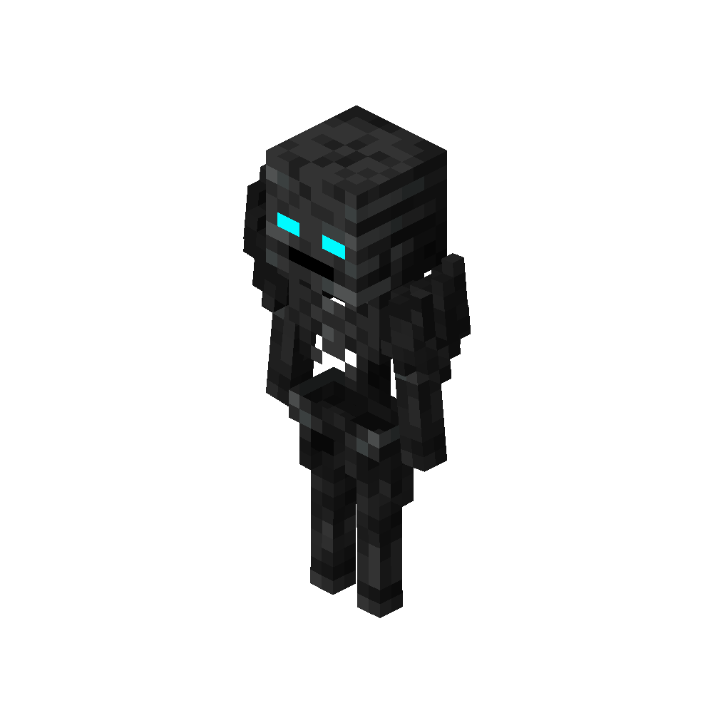

# Soul Reaper
<div class="combi">
<div class="divthing">
<table class="tablething">
    <tbody>
        <tr>
            <td class="first-column">ID</td>
            <td class="second-column">
            ```
            adventurez:soul_reaper
            ```
            </td>
        </tr>
        <tr id="linear-top">
            <td class="first-column">Health Points</td>
            <td class="second-column">120</td>
        </tr>
        <tr id="linear-top">
            <td class="first-column">Attack Strength</td>
            <td class="second-column">8</td>
        </tr>
        <tr id="linear-top">
            <td class="first-column">Projectile Strength</td>
            <td class="second-column">8</td>
        </tr>
        <tr id="linear-top">
            <td class="first-column">Spawn</td>
            <td class="second-column">In <a href="https://minecraft.fandom.com/wiki/Swamp" target="_blank">soul sand valley</a> together with the <a href="../Nightmare/">nightmare</a></td>
        </tr>
        <tr id="linear-top">
            <td class="first-column">Drops</td>
            <td class="second-column">0 - 2 <a href="https://minecraft.fandom.com/wiki/Coal" target="_blank">Coal</a><br>0 - 2 <a href="https://minecraft.fandom.com/wiki/Bone" target="_blank">Bone</a><br>0 - 1 <a href="https://minecraft.fandom.com/wiki/Head" target="_blank">Wither Skeleton Skulls</a></td>
        </tr>
        <tr id="linear-top">
            <td class="first-column">Behavior</td>
            <td class="second-column">Hostile</td>
        </tr>
    </tbody>
</table>
</div>
<div class="div-img-center">

</div>
</div>

## Story

*The Soul Reaper is the deadly variant of the <a href="https://minecraft.fandom.com/wiki/Wither_Skeleton" target="_blank">wither skeleton</a>, knows how to use a <a href="https://minecraft.fandom.com/wiki/Bow" target="_blank">bow</a> and <a href="https://minecraft.fandom.com/wiki/Sword" target="_blank">sword</a> to destroy everything that gets in its way.*

## Behaivor

While it rides the <a href="https://globoxwiki.com/mods/adventurez/nightmare/" target="_blank">Nightmare</a>, it is faster on <a href="https://minecraft.fandom.com/wiki/Soul_Sand" target="_blank">soul sand</a>.

* **Melee:** hits with a withered <a href="https://minecraft.fandom.com/wiki/Sword" target="_blank">netherite sword</a> which deals 8 damage + <a href="https://globoxwiki.com/mods/adventurez/soul-reaper/" target="_blank">wither</a>
* **Range:** shoots with a withered <a href="https://minecraft.fandom.com/wiki/Bow" target="_blank">bow</a> which deals 8 damage + <a href="https://globoxwiki.com/mods/adventurez/soul-reaper/" target="_blank">wither</a>