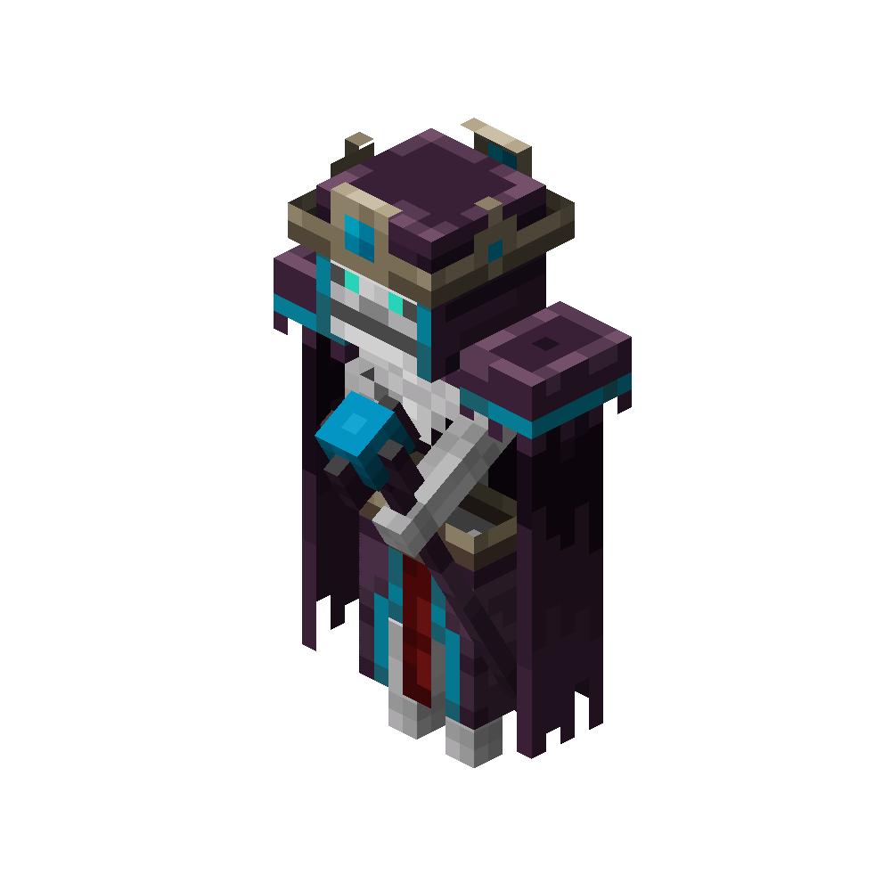

# Summoner
<div class="combi">
<div class="divthing">
<table class="tablething">
    <tbody>
        <tr>
            <td class="first-column">ID</td>
            <td class="second-column">
            ```
            adventurez:summoner
            ```
            </td>
        </tr>
        <tr id="linear-top">
            <td class="first-column">Health Points</td>
            <td class="second-column">55</td>
        </tr>
        <tr id="linear-top">
            <td class="first-column">Attack Strength</td>
            <td class="second-column">6</td>
        </tr>
        <tr id="linear-top">
            <td class="first-column">Spawn</td>
            <td class="second-column">During <a href="https://minecraft.fandom.com/wiki/Thunderstorm" target="_blank">thunderstorms</a> when a thunderbolt hits the ground</td>
        </tr>
        <tr id="linear-top">
            <td class="first-column">Drops</td>
            <td class="second-column">0 - 1 <a href="https://minecraft.fandom.com/wiki/Diamond" target="_blank">Diamond</a><br>0 - 1 <a href="https://minecraft.fandom.com/wiki/Enchanted_Book" target="_blank">Enchanted Book Lvl 30</a></td>
        </tr>
        <tr id="linear-top">
            <td class="first-column">Behavior</td>
            <td class="second-column">Hostile</td>
        </tr>
    </tbody>
</table>
</div>
<div class="div-img-center">

</div>
</div>

## Story

*The Summoner is a mighty magician who holds dominion over an enigmatic realm, wielding incredible power through their staff.*

## Behavior

* **Daytime:** Summons <a href="../Skeleton_Vanguard/">Skeleton Vanguars</a> to defend against threats.
* **Nighttime:** Summons <a href="../Skeleton_Vanguard/">Skeleton Vanguars</a>, <a href="https://minecraft.fandom.com/wiki/Zombie" target="_blank">zombies</a>, and <a href="https://minecraft.fandom.com/wiki/Skeleton" target="_blank">skeletons</a> for enhanced protection.
* **Range:** When attacked from a distance, the Summoner occasionally retaliates by hurling <a href="https://minecraft.fandom.com/wiki/Thunderstorm#Lightning" target="_blank">thunder</a> at their assailants.
* **Special:** Capable of teleporting when threatened at close range and becoming temporarily invulnerable, signaled by a glowing magic aura.