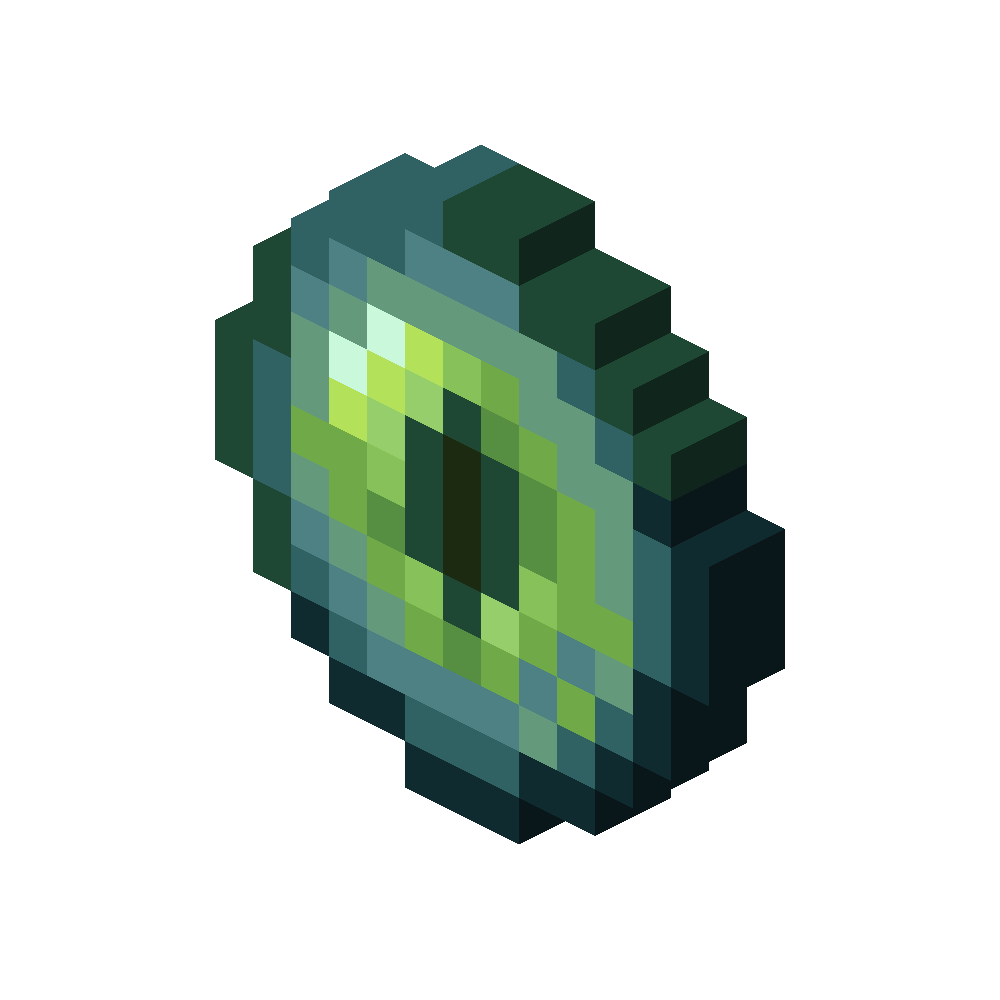

# The Eye
<div class="combi">
<div class="divthing">
<table class="tablething">
    <tbody>
        <tr>
            <td class="first-column">ID</td>
            <td class="second-column">
            ```
            adventurez:the_eye
            ```
            </td>
        </tr>
        <tr id="linear-top">
            <td class="first-column">Health Points</td>
            <td class="second-column">800</td>
        </tr>
        <tr id="linear-top">
            <td class="first-column">Attack Strength</td>
            <td class="second-column">4</td>
        </tr>
        <tr id="linear-top">
            <td class="first-column">Spawn</td>
            <td class="second-column">Can get summoned at the <a href="../../Structures/Eye_Shrine/">Eye Shrine</a></td>
        </tr>
        <tr id="linear-top">
            <td class="first-column">Drops</td>
            <td class="second-column">0 - 1 <a href="../../Items/Prime_Eye/">Prime Eye</a><br>Creates a <a href="../../Structures/Floating_Island/">Floating Island</a></td>
        </tr>
        <tr id="linear-top">
            <td class="first-column">Type</td>
            <td class="second-column">Boss</td>
        </tr>
        <tr id="linear-top">
            <td class="first-column">Behavior</td>
            <td class="second-column">Hostile</td>
        </tr>
    </tbody>
</table>
</div>
<div class="div-img-center">

</div>
</div>

## Story

*The Eye was never seen before by any human being and will drain all energy you've got until you're a dead corps.*

## Behavior

* **Range:** shoots laser beams onto the player which stop when the eye takes damage
* **Confusion:** shoots small version of itself which teleport the player around if hit
* **Duplication:** can duplicate itself multiple times which also shoot laser beams but only live for a certain time
* **Special** slowly heals itself over time and splits into 3 parts if it has less than half hp