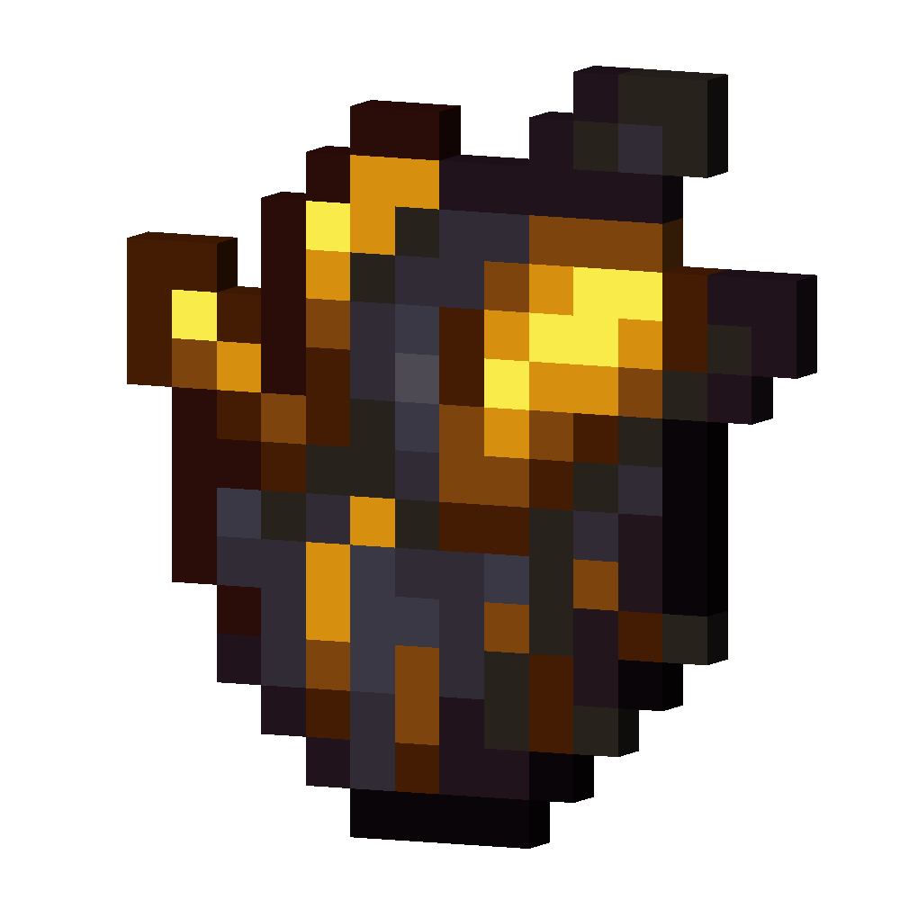

# Blackstone Golem Heart
<div class="combi">
<div class="divthing">
<table class="tablething">
    <tbody>
        <tr>
            <td class="first-column">ID</td>
            <td class="second-column">
            ```
            adventurez:stone_golem_heart
            ```
            </td>
        </tr>
        <tr id="linear-top">
            <td class="first-column"><a href="https://minecraft.fandom.com/wiki/Renewable_resource" target="_blank">Renewable</a></td>
            <td class="second-column">Yes</td>
        </tr>
        <tr id="linear-top">
            <td class="first-column">Stackable</td>
            <td class="second-column">Yes (64)</td>
        </tr>
    </tbody>
</table>
</div>
<div class="div-img-center">

</div>
</div>