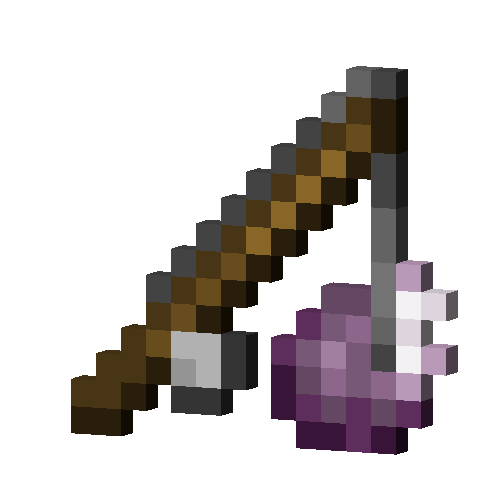
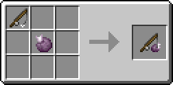
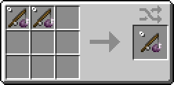

# Chorus Fruit on a Stick
<div class="combi">
<div class="divthing">
<table class="tablething">
    <tbody>
        <tr>
            <td class="first-column">ID</td>
            <td class="second-column">
            ```
            adventurez:chorus_fruit_on_a_stick
            ```
            </td>
        </tr>
        <tr id="linear-top">
            <td class="first-column"><a href="https://minecraft.fandom.com/wiki/Durability" target="_blank">Durability</a></td>
            <td class="second-column">100</td>
        </tr>
        <tr id="linear-top">
            <td class="first-column"><a href="https://minecraft.fandom.com/wiki/Renewable_resource" target="_blank">Renewable</a></td>
            <td class="second-column">Yes</td>
        </tr>
        <tr id="linear-top">
            <td class="first-column">Stackable</td>
            <td class="second-column">No</td>
        </tr>
    </tbody>
</table>
</div>
<div class="div-img-center">

</div>
</div>

## Usage
### Crafting

| Name | Ingredient | Crafting recipe |
| :---: | :---: | :---: |
| Chorus Fruit on a Stick | 1 <a href="https://minecraft.fandom.com/wiki/Fishing_Rod" target="_blank">Fishing Rod</a> +<br>1 <a href="https://minecraft.fandom.com/wiki/Chorus_Fruit" target="_blank">Chorus Fruit</a> |  |
| Chorus Fruit on a Stick | Damaged<br>Chorus Fruit on a Stick |  |