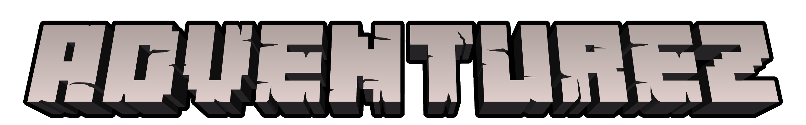

# Description

This mod adds a new end boss to Minecraft besides other deadly creatures. The boss is called "Blackstone Golem" and will be the hardest enemy you ever encountered. If you will start a war against the Piglins, watch out, they will call their Beast for help! And maybe you´ll even get caught by the Soul Reaper which usually findable in the soul sand valley. Almost forgot to mention: Somebody has seen a weird looking small creature crawling around...

Enable another end boss fight by adding VoidZ.

## Dependencies

!!! apple-keyboard-control "Required"
    === "Curseforge :simple-curseforge:"

        [Fabric API](https://www.curseforge.com/minecraft/mc-mods/fabric-api){ .md-button .md-button--primary }
        [Cloth Config API](https://legacy.curseforge.com/minecraft/mc-mods/cloth-config){ .md-button .md-button--primary }

    === "Modrinth :simple-modrinth:"

        [Fabric API](https://modrinth.com/mod/fabric-api){ .md-button }
        [Cloth Config API](https://modrinth.com/mod/cloth-config){ .md-button }

!!! apple-keyboard-option "Optional"
    === "Curseforge :simple-curseforge:"

        [Patchouli](https://www.curseforge.com/minecraft/mc-mods/patchouli-fabric){ .md-button .md-button--primary }
        [VoidZ](https://www.curseforge.com/minecraft/mc-mods/voidz){ .md-button .md-button--primary }

    === "Modrinth :simple-modrinth:"

        [Patchouli](https://modrinth.com/mod/patchouli){ .md-button }
        [VoidZ](https://modrinth.com/mod/voidz){ .md-button }